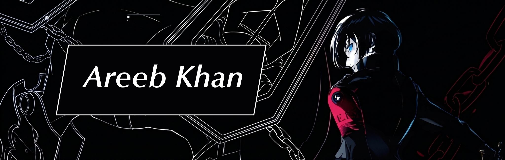

  <!-- LinkedIn Icon from @Synaptara's Readme-->
  
  &nbsp;
  
  &nbsp;
  
  &nbsp;

  <h2> About Me</h2>

    
  

    

      Hey! I'm Areeb, building my career in <code>Software Engineering</code>. I love building practical tools that people actually use (even though half of my work is
      currently locked away in private LOL). Huge Persona fan, lover of clean-sexy UI, and currently trying to balance my coding stats with my real-life courage and
      knowledge metrics.
    

    

      I'm currently developing a native desktop application using Electron, It’s currently residing in a private repository while I actually build the backend but
      it'll get out of <i><b>The Dark Hour</b></i> soon.
    

  

 

<!-- 

  <h2> Projects: </h2>
  

 -->

  <h2> What I Build With: </h2>
   <table>
    <thead>
      <tr>
        <th align="center" >Category</th>
        <th align="center">Tech Stack</th>
      </tr>
    </thead>
    <tbody>
      <tr>
        <td align="center"><b>Languages</b></td>
        <td>
          
          
        </td>
      </tr>
      <tr>
        <td align="center"><b>Frontend</b></td>
        <td>
          
          
          
          
        </td>
      </tr>
      <tr>
        <td align="center"><b>Backend</b></td>
        <td>
          
          
        </td>
      </tr>
      <tr>
        <td align="center"><b>Tools</b></td>
        <td >
          
          
          
        </td>
      </tr>
      <tr>
        <td align="center"><b>OS</b></td>
        <td >
          
          
        </td>
      </tr>
    </tbody>
  </table>

 

  

  

